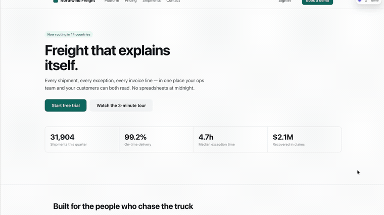
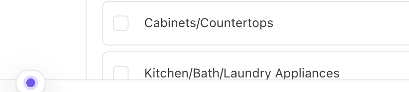
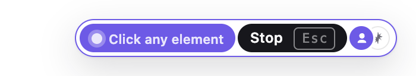
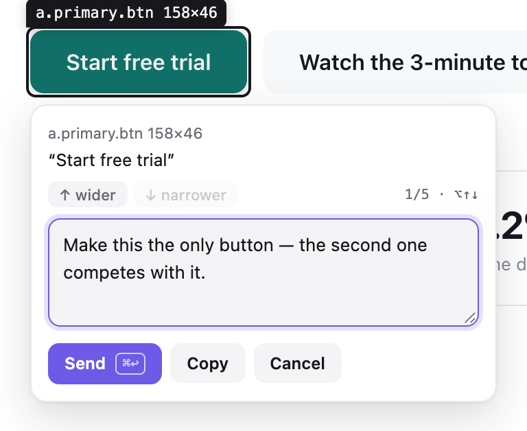
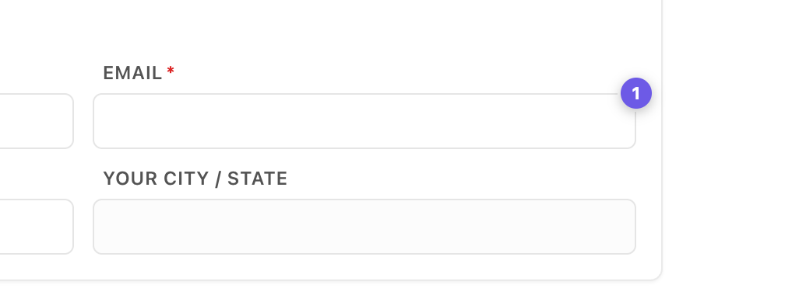
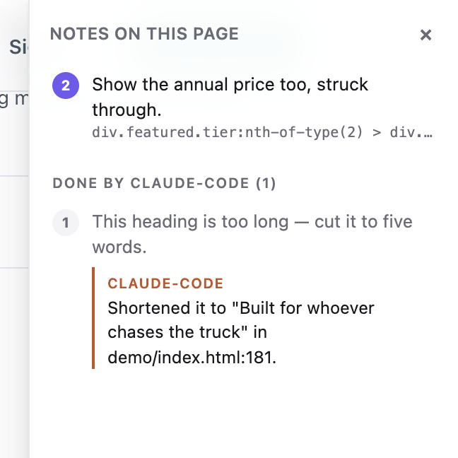

# Pinpoint

[](https://github.com/gowtham012/pinpoint/actions/workflows/test.yml)
[](LICENSE)
[](https://github.com/gowtham012/pinpoint/stargazers)

Click an element on your local dev site, write what should change, and your coding agent gets it — with the selector, DOM path, computed styles, React/Vue component chain, source-file hint and a cropped screenshot. No screenshot files piling up in your Downloads folder, no describing "the third button on the left".

```
Browser (extension) ──POST──▶ pinpoint bridge (127.0.0.1:7331) ──MCP / hooks──▶ Claude Code, Cursor, Codex…
        pins ◀──live events───┘   ~/.pinpoint/annotations.json   └── <repo>/.pinpoint/pending.md (optional)
```



*Click an element, say what should change, your agent gets it. ([full-speed video](docs/demo.mp4))*

## It is not a browser-driving agent

The distinction matters, because the two get filed together and they are opposites:

- **Playwright MCP, agent-browser, computer-use** put the agent in the driver's seat — it navigates,
  clicks and asserts. Good for testing and for browsing on your behalf.
- **Pinpoint keeps you in it.** You click, you say what should change, and the agent gets structured
  context to edit *code* with: a selector, the styles, the component chain, a source-file hint, a crop
  of the element. It never touches the page itself.
- **A pasted screenshot** carries none of that. The agent gets pixels and has to guess which control
  you meant, what it is called, and where it lives in the tree.

So it composes with browser automation rather than competing: point at the thing, let the agent change
it, let your tests drive the browser.

## Quick start

**You need** Node 18+ and a Chromium browser (Chrome, Edge, Brave, Arc, Opera, Vivaldi).

```bash
git clone https://github.com/gowtham012/pinpoint
node pinpoint/bridge/cli.js setup
```

That is the install. `setup` installs its own dependencies first, then asks — every question has a
default, so Enter all the way through is a working setup:

- **which project's UI you want to annotate** — the repo whose files your agent will be editing
- **which agents to wire up** — it detects Claude Code, Cursor and Codex and writes the MCP entry for
  each: `claude mcp add` for Claude Code, `<project>/.cursor/mcp.json` for Cursor,
  `~/.codex/config.toml` for Codex. Existing entries are merged, never replaced, and the TOML file is
  backed up before it is touched.
- **whether to install the Claude Code hooks**, which carry pending notes in with your next message
- **which browser** to load the extension into, listing the ones you actually have

Then it registers the launcher behind the popup's **Start bridge** button and starts the bridge.
Non-interactive, for a scripted machine: `node pinpoint/bridge/cli.js setup ~/code/my-app --yes`.

**The one step that cannot be a command.** Chrome does not let a terminal load an unpacked extension
into your own profile — only the Web Store or an enterprise policy can. So setup opens your browser's
extensions page and puts the `extension/` folder on your clipboard: **Developer mode** on →
**Load unpacked** → paste. The terminal confirms **✓ Pinpoint is live in Chrome** on its own, because
the bridge can see the extension connect.

**Restart Claude Code once** afterwards — it reads MCP servers and hooks when a session starts.

**Then try it.** Open your dev site (or [the demo page](#a-page-to-try-it-on)), press **⌥⇧A** /
**Alt+Shift+A**, click any element, type what should change, **⌘↩** / **Ctrl+Enter**. Type anything at
all in Claude Code and your note arrives with it. If the bar never appears, see
[Troubleshooting](#troubleshooting).

<details>
<summary>Doing it by hand instead, and the Windows / <code>file://</code> notes</summary>

`setup` writes config into your repo and your agent's files. If you would rather do that yourself,
it is four steps — and the order matters: `$PWD` is baked into the MCP entry, so step 2 has to run
from `pinpoint/bridge`, before the bridge takes over the terminal.

```bash
# 1. get it
git clone https://github.com/gowtham012/pinpoint
cd pinpoint/bridge && npm install

# 2. wire up Claude Code (once, from this folder)
claude mcp add pinpoint -s user -- node "$PWD/cli.js" mcp
node cli.js install-hooks ~/code/my-app                  # notes arrive without being asked
node cli.js install-native-host --project ~/code/my-app   # optional: the popup's "Start bridge" button

# 3. load extension/ unpacked at chrome://extensions (Developer mode on)
# 4. start the bridge, and leave it running
node cli.js --project ~/code/my-app
```

Restart Claude Code once after step 2. `--project` is optional: it keeps
`<repo>/.pinpoint/pending.md` current for agents that read a file instead of MCP.

Annotating a page you opened as a `file://` URL? Chrome keeps that off by default. On
`chrome://extensions`, open Pinpoint's **Details** and turn on **"Allow access to file URLs"**, then
reload the page.

On Windows, `$PWD` works in PowerShell and Git Bash but not `cmd.exe` — run `node cli.js --help` and
copy the ready-made `claude mcp add …` line it prints, which carries the full path already. The
shortcuts are `Alt+Shift+A` and `Ctrl+Enter`, and the UI labels them that way. `install-native-host`
is macOS and Linux only; on Windows, start the bridge in a terminal.
</details>

## Which browsers

**Chromium** — Chrome, Edge, Brave, Arc, Opera, Vivaldi. Load unpacked, as above; the test suite
drives headless Chromium, so that is the one continuously verified.
**Safari** — built rather than loaded: `bash tools/make-safari.sh` (needs Xcode).
**Firefox** — not yet.

<details>
<summary>What differs on Safari and what blocks Firefox</summary>

Safari does not take unpacked extensions, so `tools/make-safari.sh` wraps it in a small macOS app —
it converts, builds, and prints the four Safari settings to flip (the important one is
**Develop ▸ Allow Unsigned Extensions**, which resets every time Safari quits). One capability is
missing there: `"world": "MAIN"` content scripts are unsupported, so `inspector.js` cannot read React
fibers or Vue instances, which costs you the **component chain and source-file hint**. Everything else
— picking, regions, comments, pins, screenshots, the bridge, MCP — is unchanged.

Firefox is closer than it was (every script prefers `browser` where it exists), but two manifest
blockers remain: `background: { service_worker }` where Firefox MV3 wants `background: { scripts }`,
and a missing `browser_specific_settings.gecko.id`. Both are fixable, but keeping them honest needs a
Firefox job in CI rather than a claim in a README. Open an issue if you want it.
</details>

## Where it runs

Pinpoint is a tool for the app you are building, so it only loads itself on local development pages:
`localhost`, `127.0.0.1`, `.local` / `.test` / `.localhost` hosts, and `file://` pages once you have
granted file access. On any other site it is simply not there — no bar, no overlay, nothing injected.

Anywhere else — a staging URL, or a LAN address like `192.168.1.5:3000` when you are testing from your
phone — the toolbar popup turns it on for that one tab.

## Using it

While the bridge is running, a small bar sits in the **top-right** corner of every page. Click it (or
press **⌥⇧A** / **Alt+Shift+A**) to start marking. Click an element, type what should change, press
**⌘↩** / **Ctrl+Enter**, and you are immediately ready for the next one. **Esc** when you are done, or
click **Stop** on the bar. The **×** hides the bar for that site; the popup brings it back, and can
move it to any corner.

| | | |
|---|---|---|
|  |  |  |
| It tells you the shortcut, and who is here — you, and your agent. | After a few seconds it settles to a dot, out of your way. Hover to bring it back. | Picking. The bar is click-through so it can never block the element you are aiming at; **Stop** is the exception. |



The popover names exactly what you picked, so you can tell two near-identical buttons apart before you type.



A numbered pin sticks to the element — numbered per page, so each page counts from 1. Pins live in the
bridge, not the page, so they survive reloads, appear in every tab showing that page, and vanish the
moment your agent marks the change done. On apps that rebuild their DOM, each pin re-finds its own
element by identity, and hides itself rather than sit on a different element that happens to match the
old selector. The bar's counter opens the list of everything marked on this page; click a row to jump to it.

**When the page moves underneath a pin.** A pin that can no longer find its element does not just
hide itself — the bridge is told, so the next thing your agent reads says the element may be stale
rather than handing it a selector that has gone bad. And `recheck_annotation` asks your browser to
look again right now: it re-finds the element, says whether it is gone, moved out from under its
selector, or merely changed, and returns a fresh crop next to the one taken when you marked it. If no
tab is open on that page it says it could not look — never that nothing changed.

**Marking an area.** Some changes are about a group — *"make these cards two-up on mobile"*. **Drag**
instead of clicking and you get a box, anchored to the deepest element that fully contains it. Your
agent gets a real container to change, plus the list of what the box held and a screenshot cropped to it.

**Reading the reply.** A finished note does not vanish. It stays in the panel with your agent's own
reply underneath, so you can read what changed without going back to the terminal.



That reply is the `note` your agent passes to `resolve_annotation`, which is **required** — the tool
tells it that you read this in your browser, and that "done" is not an answer. While it works, the bar
says what it is doing: the note it is looking at gets a ring, and a note it completes disappears in
front of you.

Then just talk to Claude Code normally. With hooks installed you don't have to mention Pinpoint at all;
without them, say *"apply my pinpoint annotations"*. If the bridge isn't running, **Send** copies a
ready-to-paste prompt to your clipboard instead, so nothing is lost.

<details>
<summary>Starting and restarting the bridge from the browser</summary>

A browser cannot start a process, so `install-native-host` registers a tiny launcher with Chrome (and
Brave, Edge, Arc, Chromium, Vivaldi, Opera). After that the popup's **Start bridge** button works, and
while the bridge is running that button and the **↻** in the on-page bar restart it — what you want
after pulling a new build, without leaving the page.

The launcher can do exactly one thing: run this repo's own `cli.js` on a port number, read from the
popup's setting and never from the page. Restart is plain HTTP to the bridge itself, so it needs no
launcher and works in Safari too. macOS and Linux only for now; on Windows, start the bridge in a terminal.
</details>

<details>
<summary>When more than one agent is connected</summary>

Agents introduce themselves in the MCP handshake, so the bar names the one that is working
(`claude-code`, `cursor-vscode`, `codex`) instead of saying "your agent", and each reply in the panel is
attributed to whoever wrote it. `wait_for_annotation` hands each new note to exactly **one** waiting
agent, so two agents watching at once share the queue rather than both doing the same note — and if one
resolves something another already finished, it is told so.
</details>

## How your agent finds out

Three mechanisms, strongest first. They stack — using all three is fine.

- **Hooks (automatic).** `node cli.js install-hooks <repo>` adds a `SessionStart` and a
  `UserPromptSubmit` hook to `<repo>/.claude/settings.json`, both running `cli.js print --hook`. It
  prints nothing when nothing is pending, so a normal session is unaffected. Mark something in the
  browser, type anything in Claude Code, and it comes along. Your own settings in that file are
  preserved, and re-running updates rather than duplicates. Restart Claude Code once afterwards.
- **MCP (on request).** The `pinpoint` server's instructions tell the agent to check for annotations
  whenever you talk about a UI change, so "make that button bigger" usually triggers a lookup on its own.
- **A watch loop (hands-off).** Say *"watch pinpoint and apply each change as it comes in"*. The agent
  parks on `wait_for_annotation`, which returns the instant you hit Send — screenshot included.

## Connecting other agents

Both snippets need the absolute path to `cli.js`: from `pinpoint/bridge`, run `pwd` and add `/cli.js` —
or copy the ready-made line that `node cli.js --help` prints. Restart the editor afterwards; MCP servers
are read at startup.

**Cursor** — `.cursor/mcp.json` (or `~/.cursor/mcp.json` for every project):
```json
{ "mcpServers": { "pinpoint": { "command": "node", "args": ["/ABS/PATH/pinpoint/bridge/cli.js", "mcp"] } } }
```

**Codex CLI** — `~/.codex/config.toml`:
```toml
[mcp_servers.pinpoint]
command = "node"
args = ["/ABS/PATH/pinpoint/bridge/cli.js", "mcp"]
```

**Any MCP client over HTTP** — `http://127.0.0.1:7331/mcp` (Streamable HTTP, stateless). Windsurf,
Cline, Continue, Zed and Gemini CLI all take a URL.

**No MCP at all** — run the bridge with `--project <repo>` and it keeps `<repo>/.pinpoint/pending.md`
current (with its own `.gitignore`). Tell any agent "read .pinpoint/pending.md and apply it"; it
finishes each one with `node cli.js resolve <id>`. Or use *Copy prompt* in the popover to paste into any chat.

## Commands

Run these from `pinpoint/bridge`.

```
node cli.js [start]            start the bridge (default command)
node cli.js mcp                run as a stdio MCP server
node cli.js status             is it running? how many pending?
node cli.js print              pending annotations as markdown  (--consume also resolves them)
node cli.js resolve <id...> --note "what you changed"
                               mark done — the pin disappears and your note is shown as the reply
node cli.js install-hooks [dir]  wire up Claude Code
node cli.js install-native-host   let the popup's "Start bridge" button start the bridge
                               (--uninstall removes it; --id <id> allows a second checkout)
node cli.js clear              delete everything
node cli.js --help

--port <n>       default 7331, or $PINPOINT_PORT (set the same number in the popup)
--project <dir>  mirror pending annotations into <dir>/.pinpoint/
--print          echo each new annotation to stdout as it arrives
$PINPOINT_HOME   where annotations are stored (default ~/.pinpoint)
```

## MCP tools

| tool | purpose |
|---|---|
| `get_pending_annotations` | everything pending as a markdown task list, each with its screenshot |
| `list_annotations` | one line per annotation |
| `get_annotation` | full detail + screenshot for one id or pin number |
| `recheck_annotation` | re-find the element in the live page and report what changed, with a fresh crop next to the original |
| `resolve_annotation` | mark done → the pin disappears in the browser within a second |
| `wait_for_annotation` | block until the developer sends the next one |
| `clear_annotations` | wipe everything |

Resource: `pinpoint://pending` (markdown).

## What an annotation contains

```
comment          "make this full-width on mobile"          ← the only instruction
page             url, title, viewport, scroll
element          tag, id, classes, a CSS selector built from stable attributes where they exist
                 (`button[data-action="next"]` rather than `:nth-of-type(2)`; shadow DOM via
                 "host >>> inner"), DOM path, rendered text, trimmed outerHTML, role/aria/data-*
                 attributes, bounding box, ~25 computed style properties, and a fingerprint
                 (tag + text + key attributes) used to verify a pin is still on the right element
source           framework (react/vue/svelte/angular/astro), component chain,
                 file:line where the dev build exposes it
screenshot       PNG of just the element (+8px), long edge ≤1200px
```

For exact `file:line` on React 19 or Next, add a dev-only inspector plugin
(`vite-plugin-react-inspector`, `@react-dev-inspector`) — Pinpoint reads the `data-source` attributes
they emit, as well as React's own `_debugSource`/`_debugStack` and Vue's `__file`.

## Troubleshooting

<details>
<summary>No bar appears on the page</summary>

The bar only shows while the bridge is running — that is how it tells you it is live. Check
`node cli.js status` from `pinpoint/bridge`. If the bridge is up but the bar still isn't there, the page
is probably not one Pinpoint injects into automatically (see *Where it runs*) — open the toolbar popup
and turn it on for that tab.
</details>

<details>
<summary>Nothing at all on a <code>file://</code> page</summary>

Chrome keeps file access off per extension. On `chrome://extensions` → Pinpoint → **Details** →
**"Allow access to file URLs"**, then reload.
</details>

<details>
<summary>The toolbar dot never turns green</summary>

Either the bridge isn't running, or it is on a different port from the extension: the popup's **Port**
field and the bridge's `--port` must match. If `node cli.js status` says *"port answers, but it is NOT
the pinpoint bridge"*, something else owns that port — start the bridge with `--port 7332` and set 7332
in the popup too.
</details>

<details>
<summary><code>port 7331 is already in use</code></summary>

Usually the bridge is already running from another terminal, in which case you're done. Otherwise pick a
free port as above. Don't run two bridges at once: they share one store file and the last writer wins.
</details>

<details>
<summary>An annotation has no screenshot</summary>

The picture is taken just after your comment is stored, so the comment is never lost. If the page
navigated or the tab was closed in that moment, the annotation records why instead of attaching a picture
of the wrong page. The comment, selector and styles are all still there.
</details>

<details>
<summary>Claude Code doesn't mention my notes</summary>

Hooks are read when a session starts — restart it once after `install-hooks`. Check that
`<your repo>/.claude/settings.json` has two entries containing `print --hook`, and that the path in them
still exists (moving your Pinpoint clone breaks it — re-run `install-hooks`). You can always just say
*"apply my pinpoint annotations"*.
</details>

<details>
<summary>"Start bridge" says one-time setup is needed, or can't find Node</summary>

Run `node cli.js install-native-host` once, then press it again. If you have already run it, run it again
— moving the repo, or reloading a build without the manifest `key`, changes the extension's id, and Chrome
reports a rejected id the same way as a missing launcher. Quit and reopen the browser afterwards. The
launcher also bakes in an absolute path to node, because a browser-started process does not get your
shell's `PATH`; if node moved (a new nvm version, a Homebrew upgrade), re-run it.
</details>

<details>
<summary>You want a clean slate</summary>

`node cli.js clear` empties the store; `~/.pinpoint/annotations.json` is the only state outside your repo.
</details>

## A page to try it on

`demo/index.html` is a self-contained demo site — no build, no network — with the shapes that make
Pinpoint worth using: a card grid and pricing tiers for region drags, near-identical sibling buttons, a
tab panel that rebuilds itself, a dense table, and a form.

```bash
cd demo && python3 -m http.server 8080     # then open http://localhost:8080
```

## Testing

```bash
cd test && npm install && npx playwright install chromium && npm test
```

101 tests. `bridge.test.mjs` covers the daemon, CLI, hooks and every MCP tool over both stdio and
Streamable HTTP; `e2e.test.mjs` loads the unpacked extension into headless Chromium and drives real pages
— React, Vue, shadow DOM, an iframe, a strict-CSP page, a 3,600-node stress page, DPR 2, cross-tab sync,
and a form that rebuilds its whole DOM. See [CONTRIBUTING.md](CONTRIBUTING.md) for what each suite is for.

## Safety and storage

The bridge binds to `127.0.0.1`, refuses any request carrying a web page's `Origin`, and identifies
itself with a `service` marker; everything scraped from the page is labelled untrusted where it reaches
your agent, and only your typed comment is presented as an instruction. Screenshots live base64-encoded
inside `~/.pinpoint/annotations.json` rather than as loose files. [SECURITY.md](SECURITY.md) has the full
trust-boundary notes, including why the `<all_urls>` permission is needed, and [PRIVACY.md](PRIVACY.md)
says exactly what is collected, where it is stored, and the one place it leaves — the coding agent you
connect it to.

## Roadmap

- Mobile: same bridge, picker as an overlay in an Expo dev client or Capacitor webview over LAN.
- CSS source mapping via `chrome.debugger` (which rule set this colour, and where).
- Page-level annotations — a note about the whole page rather than an element or an area.
- Firefox: the manifest needs a `scripts` background and a `gecko.id`.
- Agent replies on the pin itself, not only in the notes panel.

## Contributing

Issues and pull requests are welcome — see [CONTRIBUTING.md](CONTRIBUTING.md). There is no build step:
clone it, `npm install` in `bridge/`, load `extension/` unpacked, and you are developing. Every behaviour
change should come with a test.

## Licence

MIT — see [LICENSE](LICENSE). Release notes live in [CHANGELOG.md](CHANGELOG.md).
